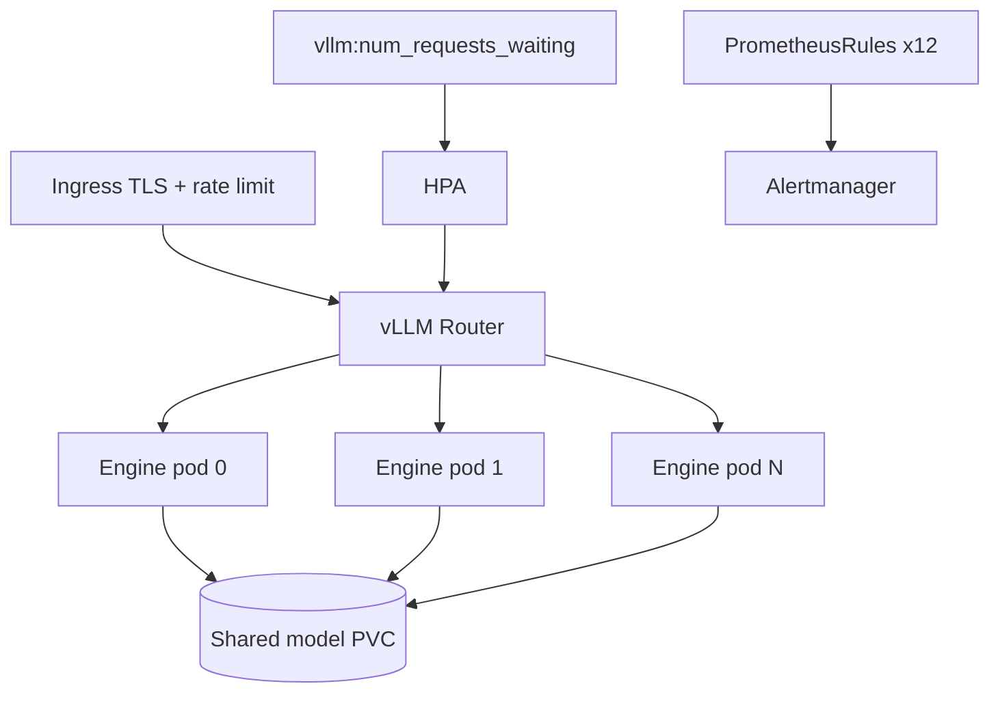
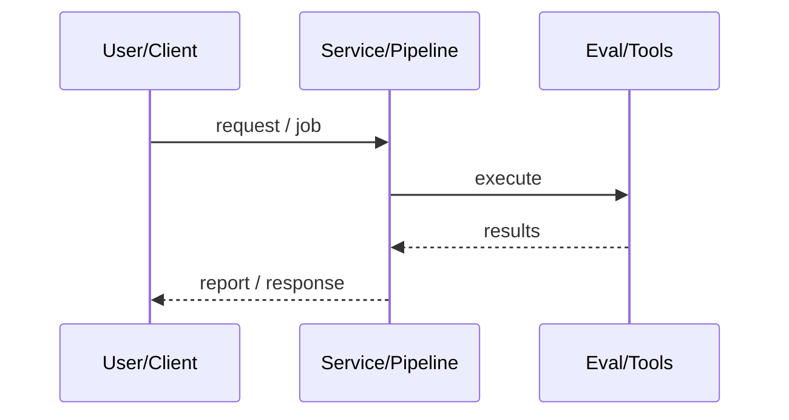
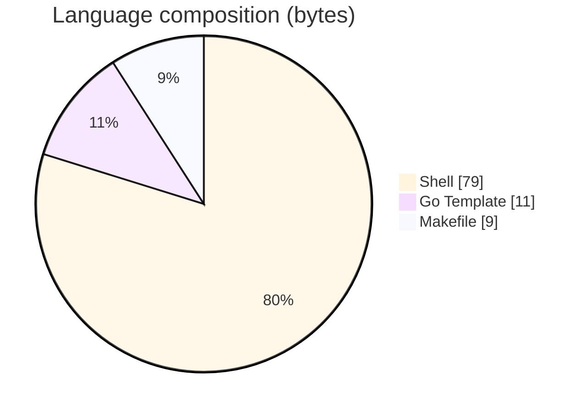

# KubeInfer

### Production Helm stack for multi-replica vLLM on Kubernetes with queue-aware HPA, NetworkPolicy, and PrometheusRules.

[](https://github.com/ArchanaChetan07/KubeInfer)
[](https://github.com/ArchanaChetan07/KubeInfer)
[](https://github.com/ArchanaChetan07/KubeInfer)
[](https://github.com/ArchanaChetan07/KubeInfer/actions)

---

## Overview

Standing up secure, scalable vLLM inference on Kubernetes requires more than a single Deployment—routing, HPA signals, alerts, and env overlays must work together.

Helm chart (vllm-stack) with session-aware router, GPU engine pods, shared PVC, MetalLB options, ServiceMonitor, env overlays (dev/staging/prod), shell bootstrap/smoke scripts, and 12 Prometheus alert rules.

29-file ops-focused repo documenting HPA scale-up when waiting>5 (+2 pods/60s), 12 named alerts, and architecture/runbook/scaling guides—README itself is template spam.

This repository is maintained as **production-minded portfolio work**: clear architecture, automated checks where present, and metrics that are **traceable to committed artifacts** (never invented).

---

## Architecture

Ingress to vLLM router Deployment to N GPU engine pods sharing model PVC; HPA watches queue depth; PrometheusRule alerts fire into Alertmanager.





---

## Results & repository facts

> Only values found in code, configs, tests, or generated reports are listed. Absence of a clinical/ML accuracy number means it was **not** published in-repo.

| Metric | Value | Source |
|---|---|---|
| Prometheus alert rules | **12** | `monitoring/alerts/vllm-alerts.yaml` |
| HPA scale-up policy (docs) | **queue > 5 per replica, +2 pods/60s** | `docs/architecture.md` |
| Prod engine replica range (docs) | **2–12** | `docs/architecture.md` |
| Ingress rate limit (docs) | **500 req/min per IP** | `docs/architecture.md` |
| Repository files | **29** | `git/trees/HEAD` |
| Tracked files | **29** | `git tree` |
| Python modules | **0** | `git tree` |
| Test-related paths | **1** | `git tree` |
| CI workflows | **Yes** | `.github/workflows` |
| Docker present | **No** | `repo root` |



---

## Key features

- Helm vllm-stack with Deployment, Service, HPA, PVC, RBAC, NetworkPolicy
- Session routing strategy for KV reuse across backends
- Queue-depth HPA via Prometheus Adapter (vllm:num_requests_waiting)
- 12 PrometheusRule alerts (availability, latency, queue, GPU, HPA)
- dev/staging/prod values overlays
- Bootstrap, helper, and smoke-test shell scripts

---

## Tech stack

| Layer | Technology |
|---|---|
| Language | Shell |
| Language | YAML / Helm |
| Tool | Kubernetes |
| Tool | Helm |
| Tool | Prometheus Operator |
| Tool | nginx Ingress |
| API | vLLM |

---

## Skills demonstrated

Shell · Helm · Kubernetes · Prometheus Operator · vLLM · nginx Ingress · CI/CD · testing · automation

Keyword surface: **Python · Shell · machine-learning · CI/CD · testing · API · Docker · automation · data-science · software-engineering · system-design · observability · LLM · cloud**

---

## Project structure

```text
KubeInfer/
├── helm/vllm-stack/
├── environments/{dev,staging,prod}/
├── monitoring/alerts/ dashboards/
├── scripts/ docs/
└── Makefile .github/workflows/
```

---

## Installation & usage

```bash
git clone https://github.com/ArchanaChetan07/KubeInfer.git
cd KubeInfer
bash scripts/bootstrap.sh
helm upgrade --install vllm helm/vllm-stack -f environments/dev/values.yaml -n llm-inference --create-namespace
bash scripts/smoke-test.sh
```

---

## How it works

Helm templates render a router Deployment that discovers engine pods and prefers session affinity for KV reuse. Engines mount a ReadWriteMany PVC for weights; HPA scales on Prometheus queue metrics. monitoring/alerts/vllm-alerts.yaml defines twelve operational alerts covering downtime, TTFT, e2e latency, KV cache fullness, preemptions, GPU temp/util, and HPA saturation.

docs/architecture.md, runbook.md, and scaling-guide.md are the real documentation; root README is template spam. No application Python package—this is platform YAML/Shell.

---

## Future improvements

- Replace template README with architecture/runbook excerpts
- Add Helm unittest coverage beyond deployment_test.yaml
- GitOps overlay examples (Argo CD/Flux)

---

## License

See repository.

---

<p align="center">
  <b>KubeInfer</b><br/>
  <a href="https://github.com/ArchanaChetan07/KubeInfer">github.com/ArchanaChetan07/KubeInfer</a>
</p>
