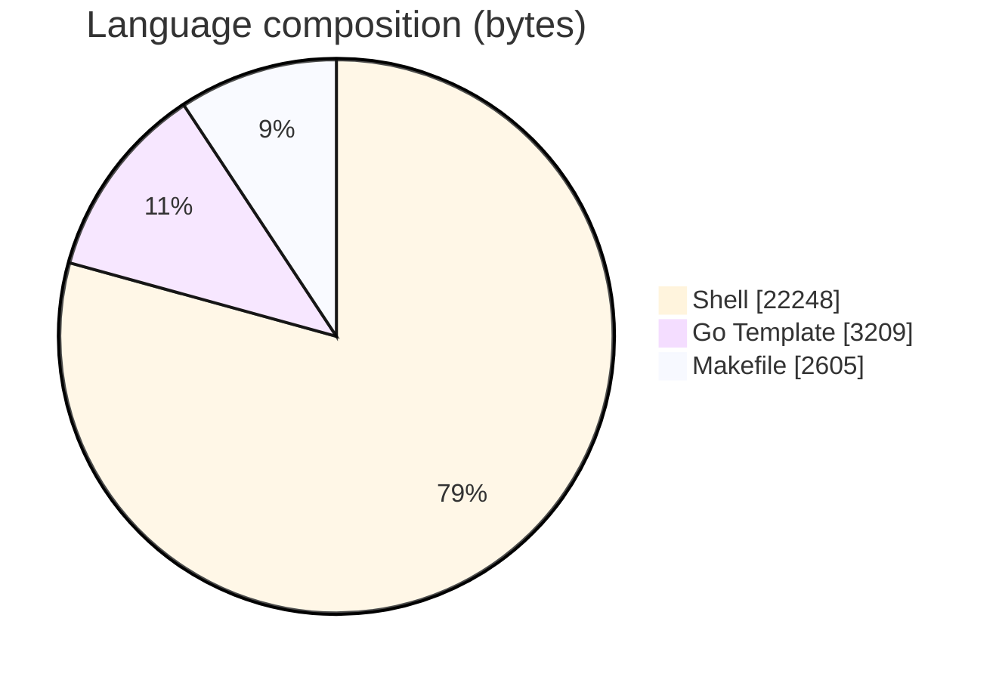
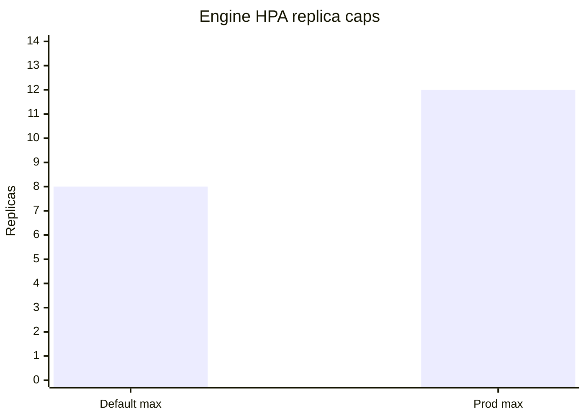
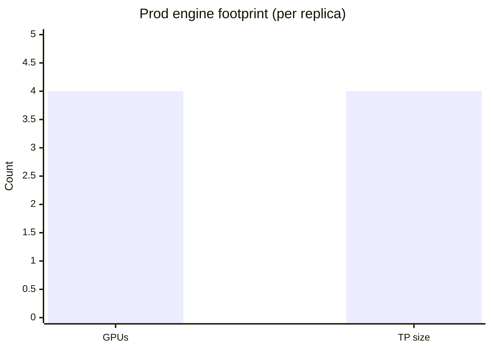
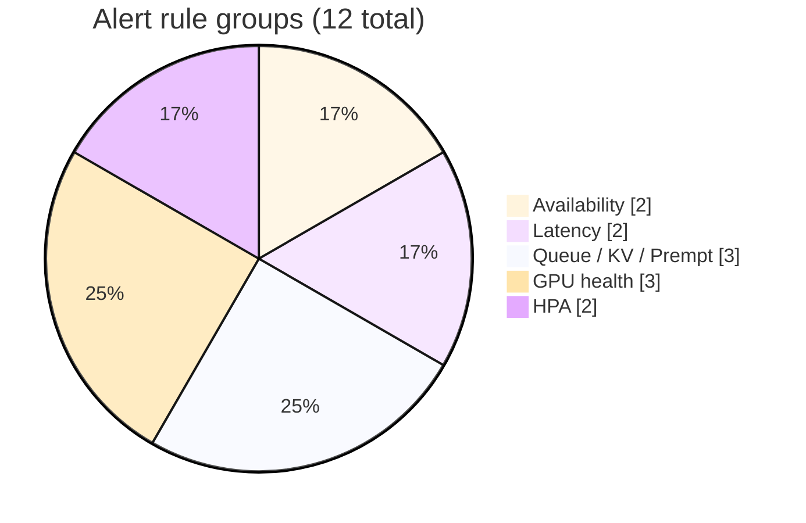
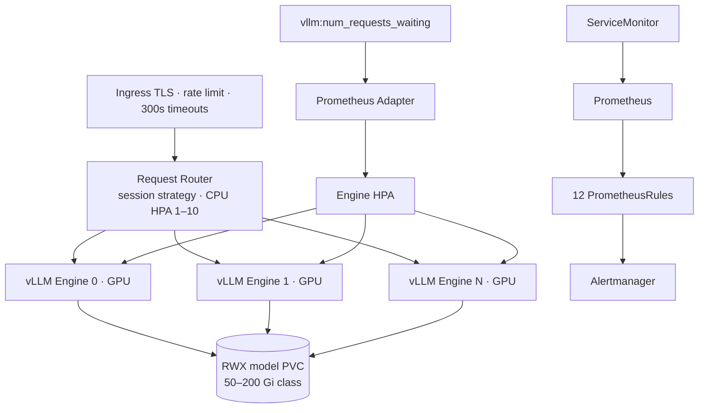
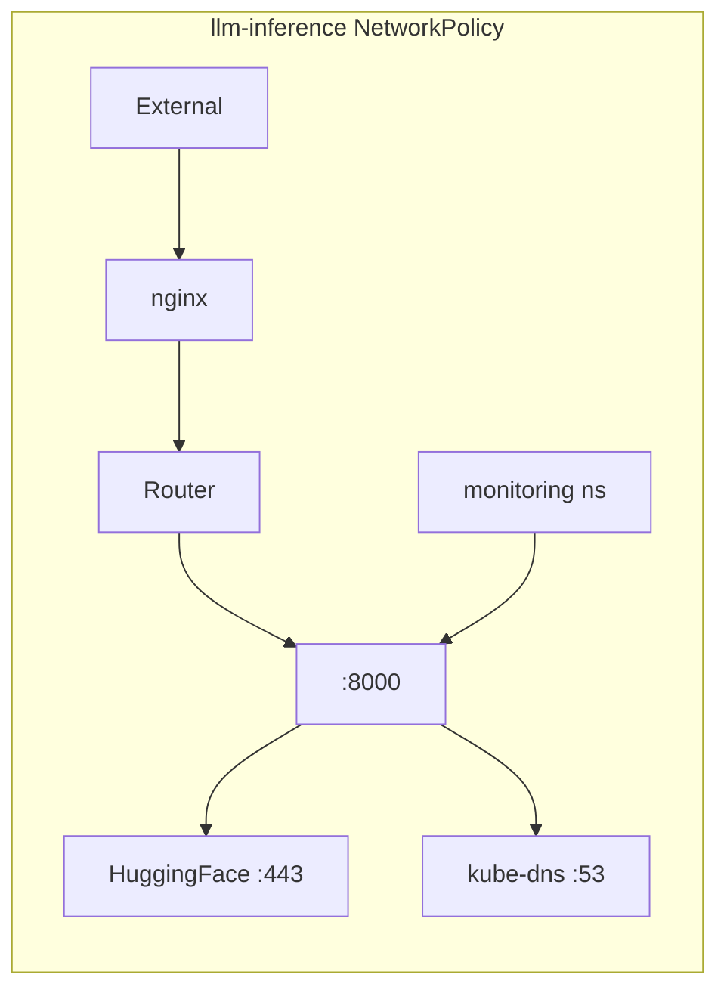
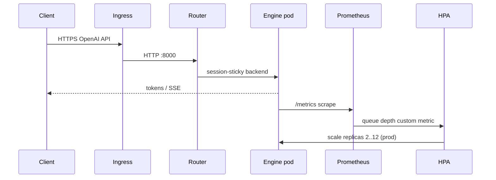

# KubeInfer

### Production **Helm** stack for multi-replica **vLLM** on **Kubernetes** — session router, queue-depth **HPA**, **NetworkPolicy**, **ServiceMonitor**, and **12 PrometheusRules**

<p align="center">
  
  
  
  
</p>

<p align="center">
  
  
  
  
  
</p>

---

## Overview

Standing up **secure, scalable vLLM inference** needs more than a single Deployment. **KubeInfer** packages a full platform chart:

| Piece | Role |
|-------|------|
| **Engine Deployment** | GPU pods · OpenAI-compatible API · `/metrics` |
| **Request router** | Session affinity for **KV reuse** across backends |
| **HPA** | Scale on `vllm:num_requests_waiting` via Prometheus Adapter |
| **RWX PVC** | Shared model cache so scale-out does not re-download weights |
| **Ingress** | TLS · timeouts · rate limits |
| **NetworkPolicy + RBAC** | Deny-by-default + least-privilege SAs |
| **Observability** | ServiceMonitor · Grafana dashboard JSON · 12 alerts |

Portfolio signal for **Platform / MLOps / Inference SRE**: queue-aware autoscaling (not CPU), production overlays, runbooks, and Helm unit tests.

> All numbers below are from committed Helm values, docs, and alert YAML. **No fabricated cluster latency SLOs.**

---

## Results & configuration facts (traceable)

### Chart & stack versions

| Item | Value | Source |
|------|--------|--------|
| Chart | **`vllm-stack` 1.0.0** | `Chart.yaml` |
| App (vLLM pin in chart) | **`0.6.6`** | `appVersion` |
| Prometheus Adapter dep | **4.10.0** (optional) | `Chart.yaml` |
| Namespace | **`llm-inference`** | defaults |
| Tracked files | **29** | git tree |
| Languages | Shell **22,248** · Go Template **3,209** · Makefile **2,605** | GitHub API |
| Helm unittest cases | **12** `it:` blocks | `tests/helm-unit-tests/` |
| Env overlays | **dev · staging · prod** | `environments/` |



### Autoscaling (docs + values)

| Knob | Default chart | Prod overlay |
|------|---------------|--------------|
| Engine HPA min / max | **1 / 8** | **2 / 12** |
| Queue threshold | **`5`** waiting / replica | **`5`** |
| Scale-up | **+2 pods / 60s**, stabilize **60s** | same |
| Scale-down | **−1 pod / 300s**, stabilize **600s** (10 min) | same |
| Router HPA | **1–10** @ **80%** CPU | router replicas **2** |
| Prod PDB | — | **minAvailable: 2** |



### Networking & ingress (architecture + prod values)

| Control | Value |
|---------|--------|
| Engine / API port | **8000** |
| Documented rate limit | **500 req/min per IP** (`docs/architecture.md`) |
| Prod nginx `limit-rps` annotation | **500** |
| Proxy read/send timeout | **300s** |
| NetworkPolicy | Deny-all + ingress→router→engine · HF :443 · DNS · Prometheus scrape |

### Model & resources (selected overlays)

| Env | Model | Engines | GPUs / replica | TP | Cache PVC | gpuMemUtil | maxModelLen |
|-----|-------|--------:|---------------:|---:|-----------|------------|------------:|
| **dev** | Phi-3-mini-4k | **1** (HPA off) | **1** | 1 | **10Gi** RWO | **0.85** | **4096** |
| **staging** | Llama-3.1-**8B**-Instruct | HPA **1–4** | **1** | 1 | shared | (chart) | **8192** |
| **prod** | Llama-3.1-**70B**-Instruct | **2** base | **4** (A100 80GB) | **4** | **200Gi** RWX `efs-sc` | **0.92** | **8192** |

Prod startup probe: **90 × 10s = 15 min** max for 70B load. Default chart startup: **72 × 10s = 12 min**.



### PrometheusRules — **12** named alerts

| Alert | Domain |
|-------|--------|
| `VLLMEngineDown` · `VLLMEngineRestartLoop` | Availability |
| `VLLMHighTimeToFirstToken` | P95 TTFT **> 10s** for 5m |
| `VLLMHighE2ELatency` | P95 e2e **> 60s** for 5m |
| `VLLMQueueDepthHigh` | avg waiting **> 20** |
| `VLLMKVCacheNearFull` | cache **> 90%** |
| `VLLMPreemptionsIncreasing` | preemption rate > 0 |
| `GPUMemoryHigh` · `GPUTemperatureHigh` · `GPUUtilizationLow` | DCGM / GPU health (temp **> 85°C** in docs) |
| `HPAAtMaxReplicas` · `HPAScalingFailed` | Capacity |



### Explicitly not claimed

- No live cluster TTFT/throughput measurements checked into this repo  
- Image digests / company domains in values are placeholders — pin digests before prod  

---

## Architecture







Docs: [`docs/architecture.md`](docs/architecture.md) · [`docs/scaling-guide.md`](docs/scaling-guide.md) · [`docs/runbook.md`](docs/runbook.md)

---

## Repository layout

```text
KubeInfer/
├── helm/vllm-stack/           # Chart 1.0.0 · templates · values.yaml
├── environments/{dev,staging,prod}/values.yaml
├── monitoring/
│   ├── alerts/vllm-alerts.yaml    # 12 rules
│   └── dashboards/vllm-dashboard.json
├── scripts/{bootstrap,helpers,smoke-test}.sh
├── tests/helm-unit-tests/
├── docs/{architecture,runbook,scaling-guide}.md
├── Makefile
└── .github/workflows/{ci,deploy}.yaml
```

---

## Quickstart

```bash
git clone https://github.com/ArchanaChetan07/KubeInfer.git
cd KubeInfer

bash scripts/bootstrap.sh
kubectl create secret generic hf-secret --from-literal=token=hf_xxx -n llm-inference

helm upgrade --install vllm helm/vllm-stack \
  -f environments/dev/values.yaml \
  -n llm-inference --create-namespace

bash scripts/smoke-test.sh
# helm unittest helm/vllm-stack/   # after: helm plugin install unittest
```

Prod-style: `-f environments/prod/values.yaml` (70B · 4×A100 · HPA 2–12 · TLS Ingress).

---

## Tech stack & keywords

| Layer | Technology |
|-------|------------|
| Orchestration | **Kubernetes**, **Helm 3** |
| Inference | **vLLM** OpenAI server · PagedAttention |
| Routing | Session-aware router (KV reuse) |
| Autoscaling | HPA + **Prometheus Adapter** (`queue depth`) |
| Ingress | **nginx** + cert-manager patterns |
| Observability | ServiceMonitor · Grafana JSON · PrometheusRules |
| Security | NetworkPolicy · RBAC · PSS baseline · Secrets |
| Quality | Helm unittest · Makefile · GitHub Actions |

**Keyword surface:** Kubernetes · Helm · vLLM · LLM inference · GPU · HPA · Prometheus · Grafana · NetworkPolicy · RBAC · MLOps · platform engineering · session affinity · KV cache · NVIDIA · A100 · GitOps-ready overlays · SRE

---

## Roadmap

- Expand Helm unittest coverage beyond `deployment_test.yaml`  
- Argo CD / Flux Application examples  
- Checked-in canary latency evidence from a real cluster smoke run  

---

<p align="center">
  <b>KubeInfer</b> · vllm-stack Helm chart<br/>
  <a href="https://github.com/ArchanaChetan07/KubeInfer">github.com/ArchanaChetan07/KubeInfer</a>
</p>
