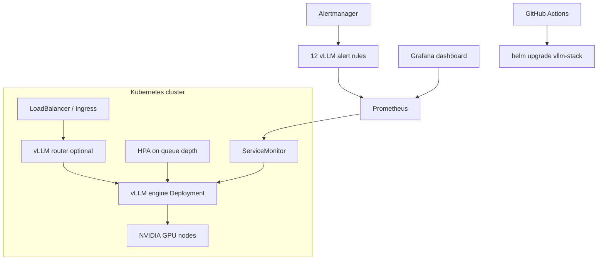

# KubeInfer

### Helm-packaged vLLM on Kubernetes with queue-depth HPA and Prometheus alert rules

[](https://github.com/ArchanaChetan07/KubeInfer/actions/workflows/ci.yaml)
[](helm/vllm-stack/)
[](helm/vllm-stack/templates/)
[](monitoring/alerts/vllm-alerts.yaml)

Infrastructure-as-code repo for running **vLLM inference on GPU Kubernetes**: a production-oriented **Helm chart** (`vllm-stack`), environment-specific values, **queue-depth HPA** (not CPU-based), **12 Prometheus alert rules**, Grafana dashboard JSON, bootstrap scripts, and GitOps-style CI. No application Python — Shell, Helm templates, and YAML only.

---

## Key Results

| Metric | Value | Source |
|---|---|---|
| Tracked files | **29** | git tree |
| Helm chart | **vllm-stack** (deployment, HPA, ServiceMonitor, PDB, RBAC) | `helm/vllm-stack/` |
| Prometheus alert rules | **12** | `monitoring/alerts/vllm-alerts.yaml` |
| HPA signal | `vllm_num_requests_waiting` avg **> 5** per replica | `helm/vllm-stack/templates/hpa.yaml` |
| Scale-up policy | **+2 pods / 60s** | `helm/vllm-stack/values.yaml` |
| Environments | dev, staging, prod values | `environments/` |
| CI workflows | lint + deploy pipelines | `.github/workflows/` |

---

## Architecture



**How it works:** the engine Deployment exposes vLLM native metrics; Prometheus Adapter feeds `vllm_num_requests_waiting` to HPA so scaling reacts to **inference queue depth** instead of idle CPU. Alert rules cover availability, TTFT/E2E latency, queue saturation, KV-cache pressure, GPU memory/temperature, and HPA saturation.

---

## Tech Stack

| Layer | Choice |
|---|---|
| Packaging | Helm 3 chart + Go templates |
| Orchestration | Kubernetes (Deployments, HPA v2, PDB, NetworkPolicy) |
| Observability | PrometheusRule CRD, ServiceMonitor, Grafana JSON |
| GPU | NVIDIA device plugin / DCGM metrics in alerts |
| Automation | Makefile, `scripts/bootstrap.sh`, `scripts/smoke-test.sh` |
| CI | GitHub Actions (`ci.yaml`, `deploy.yaml`) |

---

## Features

- Queue-depth HPA with asymmetric scale-up (fast) / scale-down (slow)
- 12 alert groups: availability, latency, queue, KV cache, GPU health, HPA
- Per-environment values overlays (`environments/dev|staging|prod`)
- MetalLB / LoadBalancer service templates
- Helm unit tests under `tests/helm-unit-tests/`
- Runbooks in `docs/runbook.md` and `docs/scaling-guide.md`

---

## Installation & Usage

```bash
git clone https://github.com/ArchanaChetan07/KubeInfer.git
cd KubeInfer

# Render / lint chart
helm template vllm-stack helm/vllm-stack -f environments/dev/values.yaml

# Bootstrap cluster prerequisites (GPU operator, monitoring)
./scripts/bootstrap.sh

# Install stack
helm upgrade --install vllm-stack helm/vllm-stack \
  -f environments/staging/values.yaml -n llm-inference --create-namespace
```

---

## Project Structure

```text
KubeInfer/
├── helm/vllm-stack/           # Chart, HPA, deployment, ServiceMonitor
├── monitoring/alerts/         # 12 Prometheus rules
├── monitoring/dashboards/     # Grafana JSON
├── environments/              # dev / staging / prod values
├── scripts/                   # bootstrap, smoke-test
├── docs/                      # architecture, runbook, scaling
└── .github/workflows/         # CI + deploy
```

---

## License

See repository license file if present.
